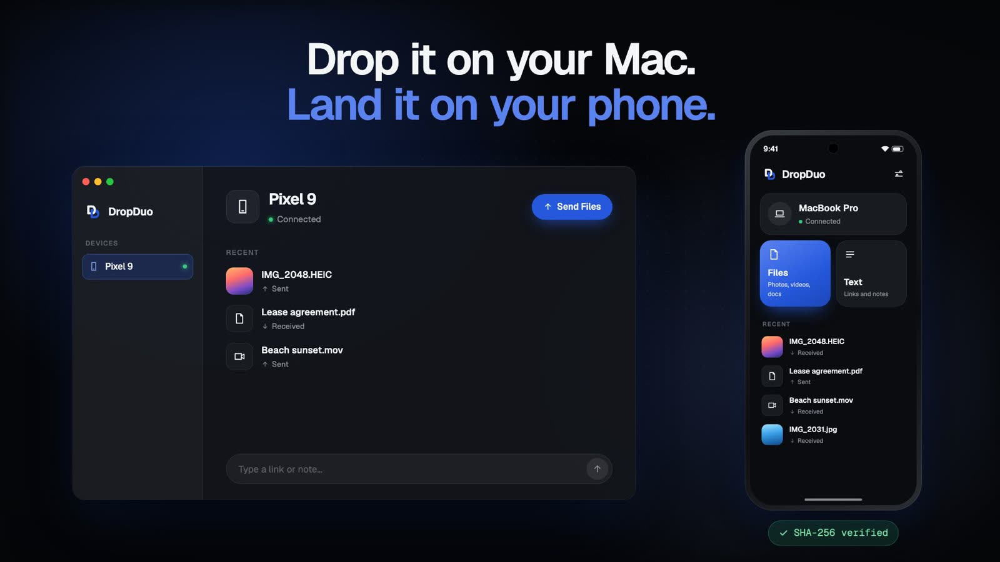

# DropDuo

**Share files, photos, text, and links between your Mac and Android phone.**

Pair once, then send over your local network. Free and open source, with no account, cloud uploads, ads, or analytics.

[Download](docs/downloads.md) · [Setup guide](docs/usage.md) · [Contribute](CONTRIBUTING.md)

▶ [Watch the 30-second demo](https://rohit-yadavv.github.io/dropduo/#demo)

## Get started

1. Install on both devices: **macOS 14+** (Apple Silicon or Intel) and **Android 10+**.
2. Connect to the same local network. Scan the Mac's pairing code on Android and approve on the Mac.
3. Drag files into the Mac app or use **Share → DropDuo** on Android. You can also send text and links.

**Early alpha:** the Mac build is not Apple-notarized and may be blocked on first launch. Follow the [installation steps](docs/downloads.md#install). Keep the Mac awake and both apps available during transfers. On Android, use **Save a copy** to keep received files after uninstalling.

Transfers are encrypted between paired devices and files are integrity-checked. The protocol has not had an independent security audit; real-device reliability and distribution signing are still [being validated](docs/validation.md).

## Help improve it

Anyone can inspect, build, or propose changes to the code. [Report a bug](https://github.com/rohit-yadavv/dropduo/issues/new?template=bug.yml) or read the [contribution guide](CONTRIBUTING.md). Keep private files and pairing codes out of reports.

[Build from source](docs/development.md) · [Documentation](docs/README.md) · [Roadmap](docs/roadmap.md)

Licensed under [Apache-2.0](LICENSE). See [dependency notices](docs/dependencies.md) and [security policy](SECURITY.md).
